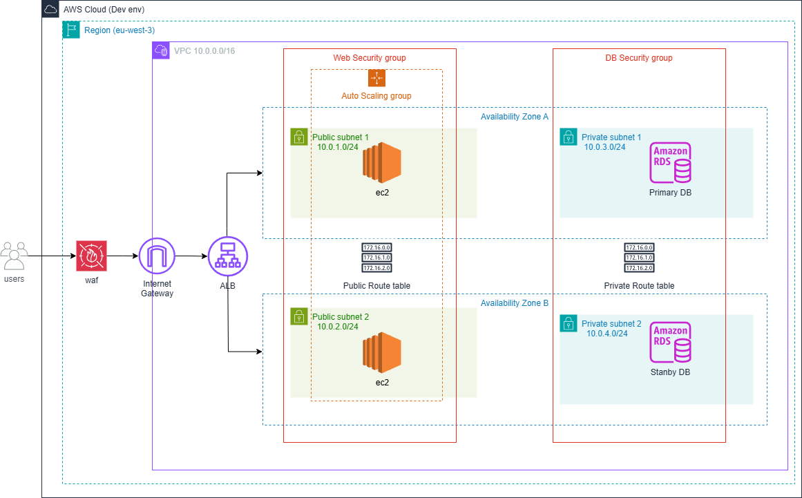

# Cloud Solutions Web app infrastructure repository

**A Terraform project that deploys a scalable web application with integrated security and observability.**  

### Architecture Overview - High Level Diagram



- **Frontend**: Python/Flask application in an Auto Scaling Group across multiple AZs  
- **Backend**: MySQL (RDS) database isolated in private subnets  
- **Networking**: Public/private subnets, secured with security groups


## Project Key Decisions and Components

### Modular Architecture
- Independent Terraform modules for clear separation and easier reusability
- Environment-based configuration (dev / preprod / prod)
- Remote state storage in an S3 bucket 

### Security

- **IAM Roles**:
  - `EC2 Instance Role`: Grants only necessary permissions for CloudWatch logging/metrics and SSM access
  - `RDS Monitoring Role`: Dedicated role for database monitoring
  - All roles follow least-privilege principles
- Public/private subnet segregation: Web tier in public, DB in private
- Security groups with least-privilege access
- AWS Secrets Manager for secure credential storage
- AWS Web Application Firewall (WAF) protects the application from common web exploits.

### High Availability
- Multi-AZ deployment for RDS to ensure database failover and uptime
- Auto Scaling Groups for EC2 instances to maintain application availability
- Application Load Balancer distributes traffic across healthy instances
- Automated backups and maintenance windows for RDS

### Observability
- Centralized logging with CloudWatch Log Groups 
- CloudWatch Alarms for key metrics (CPU, DB connections, ALB errors) with alerting
- Monitoring roles and monitoring enabled for RDS

---

## Technology Choices 

- **Amazon RDS (MySQL):**
  - Managed database service for automated backups, patching, and high availability.
  - Chosen for reliability, ease of maintenance, and support for Multi-AZ deployments.
  - Offloads operational overhead compared to self-managed databases.
  - Easy to restore data if something goes wrong. 

- **Amazon EC2:**
  - Selected over lambda because the exercise specified a web application expected to serve thousands of users worldwide, requiring high traffic support and scalability beyond typical Lambda use cases.
  - Easier to manage traditional web applications and scaling with Auto Scaling Groups.


- **AWS Application Load Balancer (ALB):**
  - Distributes incoming HTTP/HTTPS traffic across EC2 instances.
  - Supports path-based routing and integration with Auto Scaling.
  - Makes sure users always reach a healthy server, and can handle lots of users at once by spreading the load.

- **CloudWatch & Logging:**
  - Centralized logging and monitoring for infrastructure and application health.
  - Enables alerting and automated scaling actions.

---

## Deployment Guide

### Initial Setup (One-Time)

Before running Terraform, complete the following:

#### Create S3 Bucket for Remote State

```bash
aws s3api create-bucket --bucket "tf-state-dev-s3"   --region eu-west-3   --create-bucket-configuration LocationConstraint=eu-west-3
```

> This S3 bucket is used to store the Terraform remote state.

#### Store Database Password in AWS Secrets Manager

```bash
aws secretsmanager create-secret   --name "dev/database/password"   --secret-string "your_secure_password"
```
---

### 1. Initialize Terraform

- **Development:**

```bash
terraform init -backend-config="backends/cloud_solutions_dev.tfvars" -reconfigure
```

- **Pre-production:**

```bash
terraform init -backend-config="backends/cloud_solutions_pre.tfvars" -reconfigure
```

- **Production:**

```bash
terraform init -backend-config="backends/cloud_solutions_prod.tfvars" -reconfigure
```

Verify available workspaces:

```bash
terraform workspace list
```

### 2. Select or Create Workspace

- **Create a new workspace:**

```bash
terraform workspace new cloud_solutions_dev
```

- **Or select an existing workspace:**

```bash
terraform workspace select cloud_solutions_dev
```

### 3. Plan Deployment

- **Development:**

```bash
terraform plan -var-file="environments/dev/developing.tfvars"   
```

- **Pre-production:**

```bash
terraform plan -var-file="environments/preprod/preproduction.tfvars"   
```

- **Production:**

```bash
terraform plan -var-file="environments/prod/production.tfvars"   
```


### 4. Apply Deployment

- **Development:**

```bash
terraform apply -var-file="environments/dev/developing.tfvars"   
```

- **Pre-production:**

```bash
terraform apply -var-file="environments/preprod/preproduction.tfvars" 
```

- **Production:**

```bash
terraform apply -var-file="environments/prod/production.tfvars"   
```


### 5. Destroy Resources (If Needed)

To destroy the infrastructure for a specific environment:

```bash
terraform destroy   -var-file="environments/dev/config.tfvars"   
```

---

> **Note:**
> Some code in this repository is commented out to enable HTTPS configuration. It is left commented intentionally to deploy the infrastructure without needing to create or manage an SSL/TLS certificate up front. To enable HTTPS, simply uncomment the relevant sections and provide your certificate details.

